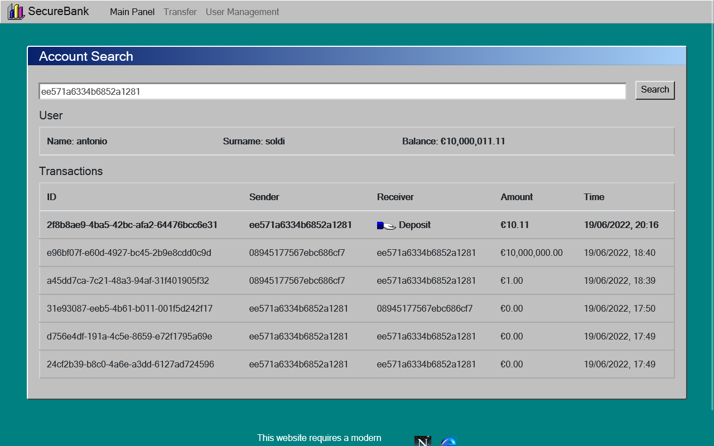
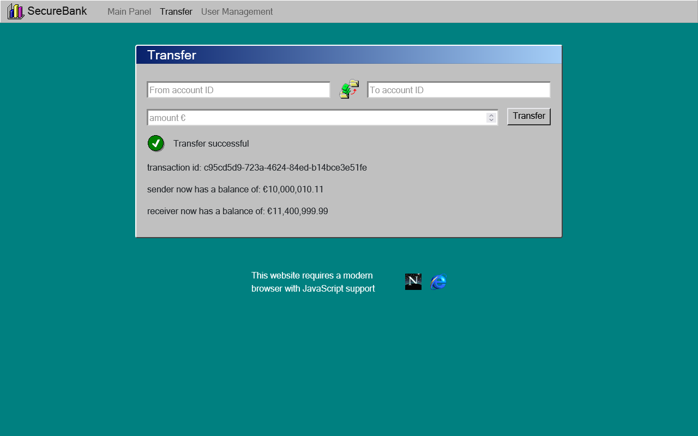
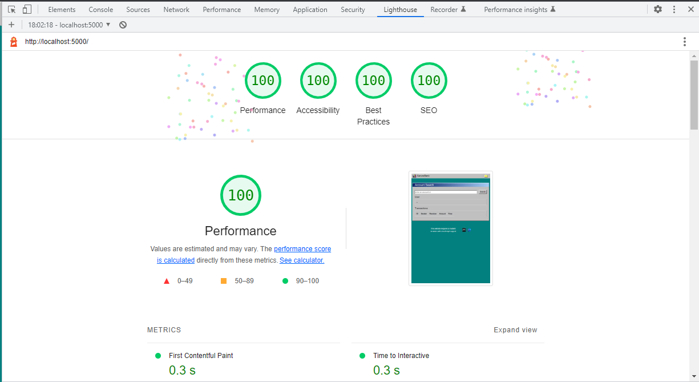

This is a project for the distributed systems course i took at uniMib.
It's supposed to be a mock banking system with a REST api, relational database
and rich web application.

I decided to implement it using the following technologies

- **web**: Svelte.js framework with vite.js as bundler and devserver. Nginx as production server
- **api**: Python, with FastAPI
- **database**: Mariadb
- **infrastructure**: docker-compose / kubernetes

As for the design, i went for a win95 aesthetic as you can see. It
started as a joke,  but the win95 design system turned out to be pretty nice
to work with, and very accessible.

  

